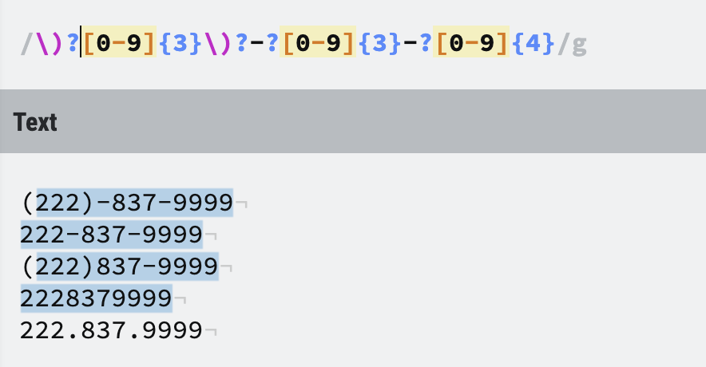

 - String manupulation   
    * renaming files  
    * parsing system log  
 
 - Web Scraping   
    * Extracting email address, telephone number  
 
 - Data Manipulaiton 
    * column selection  
    
> Useful website: https://regexr.com/

# Basic Syntax  

### Literal Text  

  - case sensitive  
  
  - global match  
  
### Wildcards  

  to find group of string
  
  `.`(a dot) 
  
  - matches any characters  
  
  - Use `\.` to represent a literal dot

### Set of Characters  

  to find specific set of characters  
  
  `[]` match any of character within in , but not matching all of them  
  
  `[^]` match any of character except those within the brackets  
  
  `[-]` specify ranges, however, `[A-z]` also includes characters like `[` and `^`
  
  
### Meta Characters 

 `\w` any alphanumeric character; same as `[A-Za-z0-9_]`
 
 `\W` for negation  
 
 `\d` any digit; same as `[0-9]`; negation `\D`
 
 `\s` any whitespace character; negation `\S`
 
### Repeating Matches   

  `?` match zero or 1 times  
  
  `*` match arbitrary times (including 0)  
  
  `+` match one or more  
  
  `{min,max}`(min times to max times), `{min,}`(minum times or more),`{,max}`(maximum times or less), `{num}`(exact num times)
  
  {width=60%}
  
### Greedy or Lazy?  

 - Append `?` to the end of repeat matches with no upper bounds, e.g., `{n,}?`,`*?`,`+?`.
 
 - Default setting is greedy matching

#### Position Matching 

  `\b` matching positions between `\w` and `\W` (word boundaries)  
  
  `\B` matching any positions except those between `\w` and `\W`  
  
  `^` matching the start of a string. e.g., `^b` matching the string starting with `b`  
  
  `$` matching the end of a string.  
  
# Advanced Syntax  

#### Capturing Group   

1. Group 0

2. Group 1.. \num

Regex: `(\d{3}-){2}\d{4}`  Group1: `(\d{3}-)`   
Regex: `(\d{3}-)(\d{3}-)\d{4}`  Group1: `(\d{3}-)`    Group2: `(\d{3}-)`  
Regex: `(\d{3}-)\1\d{4}`     `\1` means to match the first string who match  

#### Look Around  

Four types of look around  
1. positive look ahead `?=`  `(?=t)` means matching the one who is before `t`
2. positive look behind `?<=`   `(?<=e)` means matching the one who is behinding `e`
3. negative look ahead `?!`  
4. negative look behind `?<!`

`(?<=e)a(?=t)` matching `eat` pattern (matching `a` whose left side is `e` and right side is `t`)  

breaking line: `.{5,}\K\s+`

